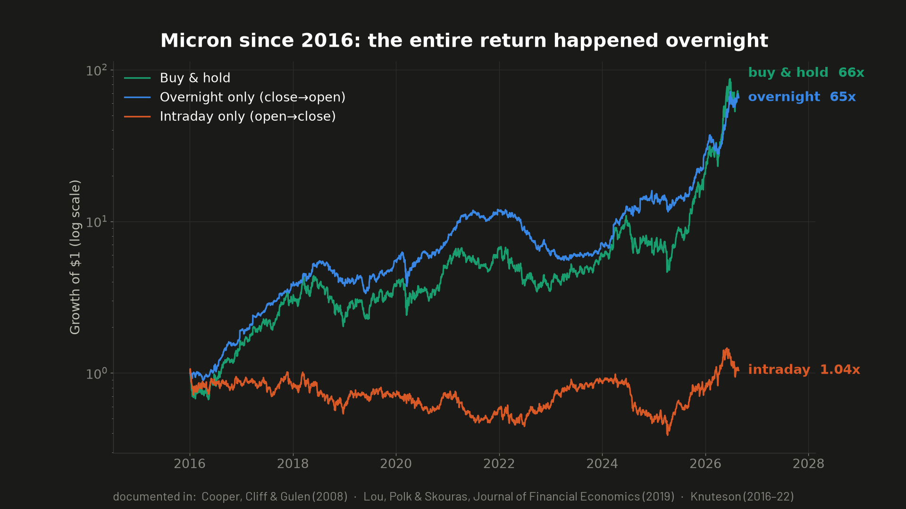
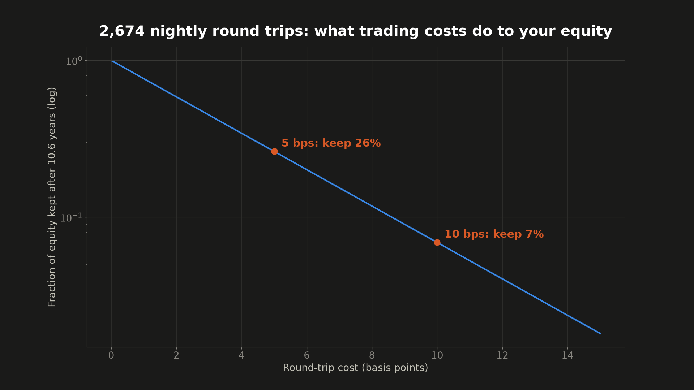
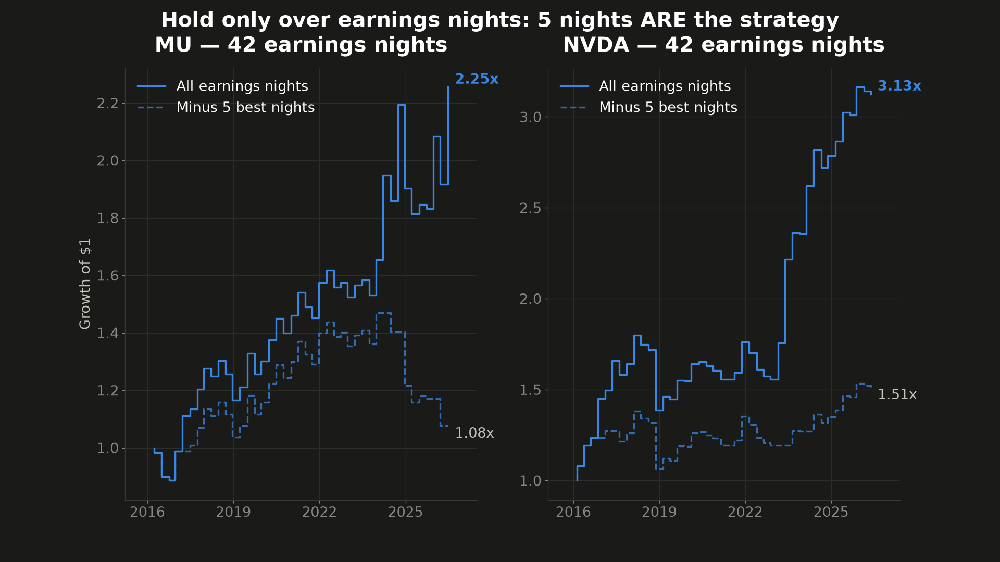
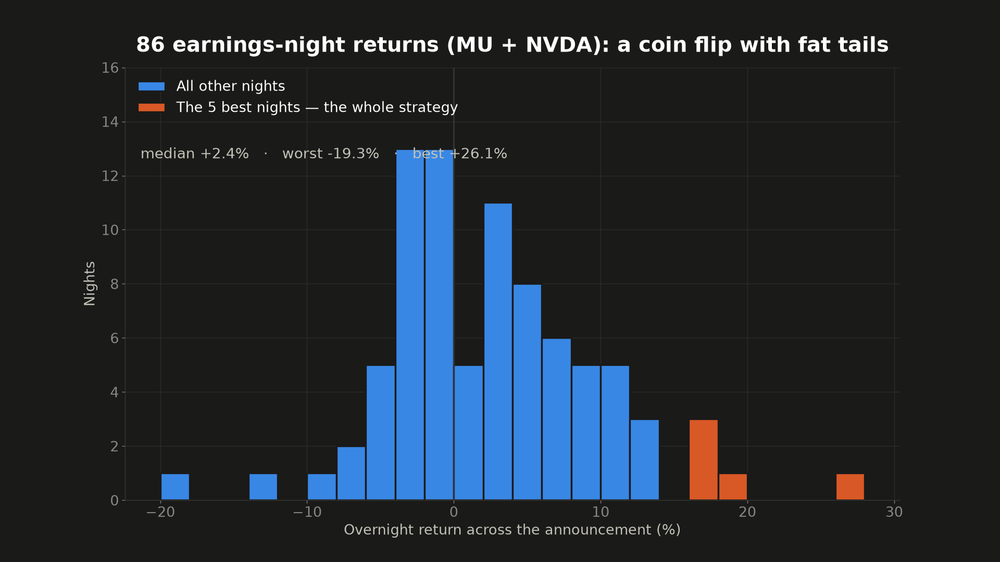
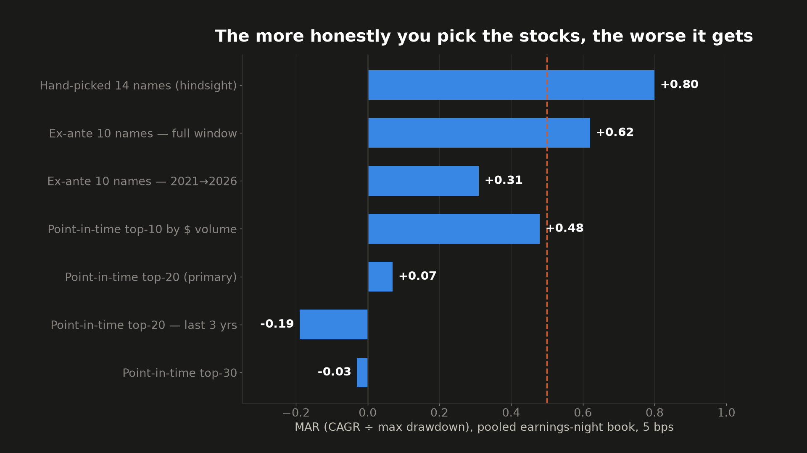

# Episode 1 — The Overnight Effect: Real Anomaly, No Tradable Edge

**Video:** [watch on YouTube](https://youtu.be/5qfa33NTavM)
**Verdict: DEAD.** The viral overnight-return anomaly is real, but no tradable version of it survives honest testing.

## Origin

A viral post (August 2026) claimed that buying Micron (MU) at every market close and selling at every open since inception returns +138,330,342% — while the reverse (open→close) loses −99.2%. Related academic work: Cooper, Cliff & Gulen (2008); Lou, Polk & Skouras, *Journal of Financial Economics* (2019); Bruce Knuteson's overnight/intraday series (2016–22).

Two questions tested:
1. Is the claimed overnight/intraday split real? (**Yes.**)
2. Can it be harvested — every night, or concentrated into earnings nights? (**No.**)

## Data & method

- **Prices:** SIP daily bars, `adjustment=all`, 2016-01-04 → 2026-08-21 (2,674 trading days), via a paid feed (code uses Alpaca's API — bring your own keys in `~/.alpaca/credentials`).
- **Earnings dates/times:** SEC EDGAR 8-K filings with Item 2.02, using `acceptanceDateTime` to classify after-hours vs. before-open. No third-party earnings calendar. Free, primary source.
- **Overnight return:** open(t+1)/close(t) spanning the announcement. **Intraday:** close(t)/open(t). Compounded; costs as stated per table.
- **Deployment bars used throughout:** MAR (CAGR ÷ max drawdown) ≥ 0.5 AND annualized Sortino ≥ 1.0.
- Code in this folder: [`overnight_earnings_backtest.py`](overnight_earnings_backtest.py) (pooled earnings-night book + kill tests), [`overnight_earnings_ptuniverse.py`](overnight_earnings_ptuniverse.py) (point-in-time universe test), [`make_charts.py`](make_charts.py) (the video's charts).

## Result 1 — the anomaly replicates (2016 → 2026-08)

| Ticker | Overnight only | Intraday only | Buy & hold |
|---|---|---|---|
| MU   | +6,660% | +6.0%  | +7,067% |
| NVDA | +7,920% | +240%  | +27,194% |
| SPY  | +158%   | +74%   | +349% |

Essentially all of MU's decade accrued while the market was closed. The viral numbers are honest arithmetic — assuming ~2 frictionless auction fills per day for decades. At 5 bps per round trip, 2,674 days of daily trading multiplies terminal equity by ~0.26; at 10 bps, ~0.07. Every gain is short-term taxable. Real-money proof: NightShares NSPY launched June 2022 to harvest exactly this, returned −6.9% vs S&P +22%, and liquidated in about a year.




## Result 2 — earnings-nights-only fails

Hold only across each earnings announcement night (~4 trades/yr, costs negligible). Recomputed with the checked-in harness rules (midday-timestamped filings excluded — no clean overnight gap):

| | MU (42 nights) | NVDA (42 nights) |
|---|---|---|
| Cumulative | 2.25x | 3.13x |
| CAGR | +8.3% | +11.8% |
| MaxDD | 17.4% | 23.0% |
| **MAR** | **0.48** (fail) | **0.51** (scrapes by) |
| Win rate | 57% | 55% |
| **Drop 5 best nights** | **+0.7%/yr** | **+4.1%/yr** |

The per-night edge (~+2.2% avg on MU) is just the earnings-announcement premium, delivered as a coin flip with −13% to −19% single-night tails. Removing five nights out of 42 collapses both books: the tails ARE the strategy.




## Result 3 — the pooled book that almost fooled me

14 high-attention names (MU NVDA TSLA AMD MSTR AAPL AMZN META GOOGL MSFT NFLX COIN PLTR SMCI), 396 events, 25% of equity per event, 5 bps: **MAR 0.80, Sortino 1.52, positive 10 of 11 years, survives drop-top-5 and drop-best-name.** A shippable-looking result.

It's manufactured. The universe was picked with today's attention: PLTR and COIN weren't public in 2016; MSTR was a sleepy software company. Hindsight selection.

**Ex-ante 10 names** (what a 2016 investor could have listed): first half MAR 1.10 → second half **0.31**. The edge decayed after publication.

**Fully honest (point-in-time) universe:** 150-name base list, trailing-252-day dollar-volume ranking, top-N rebalanced quarterly, members-only participation:

| Point-in-time book (5 bps) | CAGR | MAR |
|---|---|---|
| TOP-10 full | +7.7% | 0.48 |
| **TOP-20 (primary)** | **+2.0%** | **0.07** |
| TOP-20 last 3y | −5.5% | −0.19 |
| TOP-30 full | −1.3% | −0.03 |

Monotone: the more honest the universe, the worse the book. The hand-picked pass was "own AI winners overnight during an AI boom" — hindsight wearing a strategy costume.



## Conclusions

- Overnight/intraday split: **confirmed, not tradable.** The daily form dies on the cost wall (a real fund died proving it); the event form is a five-nights-a-decade lottery; the honest universe has nothing.
- The actionable takeaway points the other way: returns accrue overnight → **stay invested.** Day-trading systems that go home flat each night sit out the only part of the day that historically pays.
- Methodological: any event-driven backtest that headline-passes should be required to survive (a) drop-top-K events and (b) a point-in-time universe before anyone sizes it. This one failed both, in order.

## Reproducing

```
python3 overnight_earnings_backtest.py     # pooled earnings-night book + kill tests
python3 overnight_earnings_ptuniverse.py   # point-in-time universe test
python3 make_charts.py                     # regenerate the video's charts
```

Requires Python 3.11+, `matplotlib`, an Alpaca market-data key in `~/.alpaca/credentials` (`ALPACA_KEY=` / `ALPACA_SECRET=`), and your own contact info in each script's SEC `User-Agent` string (EDGAR policy).

*Not investment advice. Could be right, could be wrong — that's why the code is here.*
