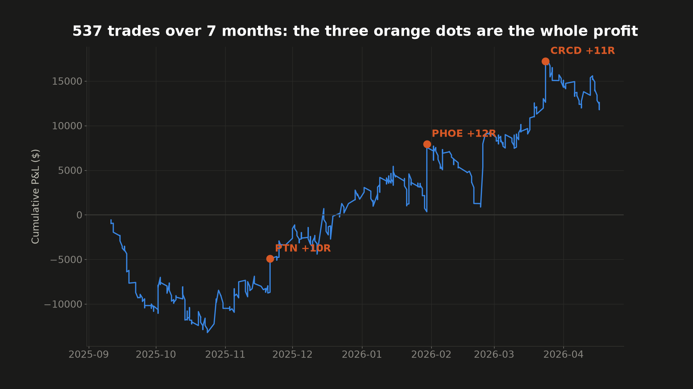
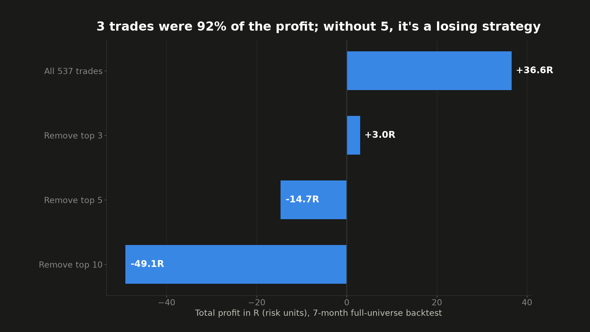
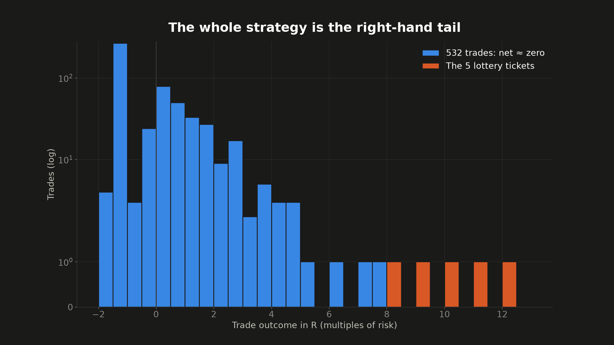
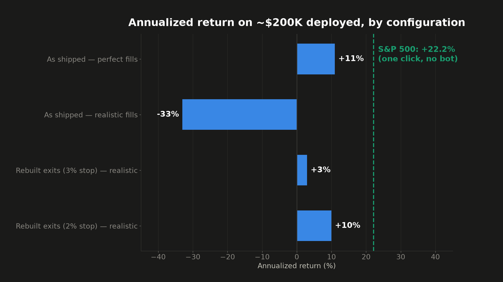
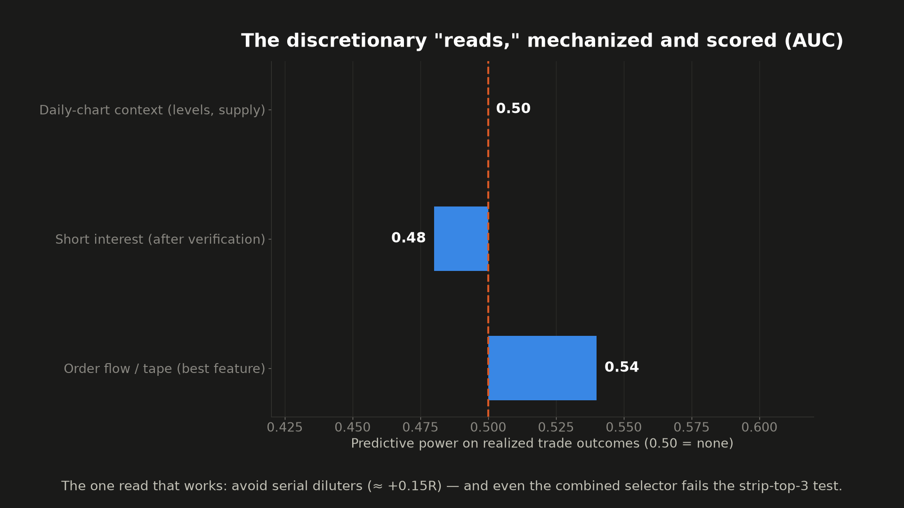

# Episode 2 — Gap-and-Go: Real Edge, Not Bottle-able

**Video:** [watch on YouTube](https://youtu.be/UwaxnD3bStE)
**Verdict: teachable, not deployable.** The pattern is real and a disciplined scan surfaces it, but on retail data and retail fills a bot can't capture it — the profit is a handful of unpredictable "monster" mornings. One honest, mechanizable edge survives: **avoid serial diluters.**

## Origin

On 2026-06-09 a microfloat stock, **PAVS**, ran about **+2,738%** in a single day — the biggest one-day mover of the year, and exactly the setup gap-and-go momentum exists to catch. I had a bot built for it. It found PAVS, traded PAVS, and **lost about $618** (entered ~3 hours after the open, stopped out in the afternoon fade). That contradiction is the whole episode.

Questions tested:
1. Does the strategy pass an honest, full-market backtest? (**Headline yes; robustness no.**)
2. If a bot "just lacks discretion," can the discretionary *reads* be mechanized? (**Mostly no — one survives.**)

## Data & method

- **Universe & screen:** every US stock, intraday. Setup: **gap ≥ 10%, price $2–$20, float < 50M, RVOL ≥ 5×**, entry on the bull-flag / breakout on 1-min bars.
- **Backtest window:** 2025-09-11 → 2026-04-17, **537 trades**, run in paper trading against history after fixing a live↔backtest mismatch (a daily-bar screen was missing ~40% of the setups the live intraday bot actually took; fixing it made the strategy look *better*, not worse).
- **Sizing:** ~$24,700 notional × 0.25 tranche × conviction (1–3×), 3% max risk, 8 slots ≈ **$197,600** deployed capital.
- **The full trade log is in this folder** — [`trades.csv`](trades.csv), all 537 trades with entry/stop/target/exit, R-multiple, gap %, RVOL, float, and the conviction/gate signals. [`reproduce.py`](reproduce.py) recomputes every kill-test number below from it, no credentials required.
- **Bar:** MAR (CAGR ÷ max drawdown) ≥ 0.5 AND Sortino ≥ 1.0.

## Result 1 — the headline passes, and it's a lottery

Headline (as-shipped, clean fills): **+$12,505 over the window, +36.6R, 44% win rate.** A real 537-trade sample — the number a course puts on the thumbnail.

Then the kill test. Strip the best trades by risk-multiple:

| Book | Total |
|---|---|
| all 537 trades | **+36.6R** |
| minus top 3 | +3.0R — *the top 3 are 92% of all profit* |
| minus top 5 | **−14.7R** — goes negative |
| minus top 10 | −49.1R |

The strategy doesn't have 500 small edges; it has **5 lottery tickets and 532 scratch-offs**. The other ~530 trades net to roughly nothing (average trade +0.07R). The five tickets over seven months:

| Date | Ticker | R |
|---|---|---|
| 2026-01-30 | PHOE | +12.2R |
| 2026-03-24 | CRCD | +11.2R |
| 2025-11-21 | PTN  | +10.2R |
| 2025-12-15 | AMCI | +9.2R |
| 2025-10-02 | BTTC | +8.5R |





## Result 2 — what it pays after reality (vs. the index)

Annualized return on the ~$200k base, by configuration:

| Configuration | Fills | Annualized | vs SPY |
|---|---|---|---|
| As-shipped | clean | ~+11% | underperforms |
| As-shipped | realistic | **~−33%** | far worse |
| Exit-rebuilt, 3% stop | realistic | ~+3% | underperforms |
| Exit-rebuilt, 2% stop | clean | ~+27% | beats* |
| Exit-rebuilt, 2% stop | realistic | ~+10% | ≈ matches |
| **SPY (benchmark)** | actual | **+8% window / +22% TTM** | — |

The honest middle case (~+10%) merely *matches* the index — over a rising tape (SPY +22% TTM) that flattered a long-biased strategy. The as-shipped config **lost money on realistic fills.** *The ~+27% best case carries an intrabar-resolution optimism (target and stop inside one 1-min bar; the sim books the target first) — the 3% row is the trustworthy floor. And on microfloat names like PAVS (float ≈ 263k) the sim "buys" several percent of the float in one order — capacity the real market won't give you, so the dollar ROI doesn't scale.



## Result 3 — mechanizing the guru's "reads"

The standard objection: the bot just lacks the experienced trader's *discretion*. So each discretionary read was mechanized and scored against realized trade outcomes on professional-grade data:

| Read | Result |
|---|---|
| Daily-chart context (supply, levels, prior runners) | **Null** — apparent signal was a pool/label confound (real-trade AUC ≈ 0.50) |
| Short interest (squeeze story) | Looked strong on the label (AUC 0.57), **died on realized-R verification** (AUC 0.48) — a label artifact |
| Order flow / tape (aggression, speed, book, prints) | All weak (AUC ≤ 0.54) |
| **Dilution (EDGAR offering history)** | **Weak but real, and it survives verification** — the one read that mechanizes |
| Combined walk-forward selector | Ranks trades out-of-sample (+0.10R lift), but the selected half still loses, and it fails the same strip-top-3 test |

The features can tell *better* trades from *worse* ones. What they can't do — on the richest data available — is tell you which gapper becomes the monster. And the monsters are the entire P&L.



## What survives — avoid the serial diluters

The one genuinely mechanizable, money-saving finding: **companies that repeatedly sell new shares into every pump make worse trades.** Non-diluters averaged −0.17R vs serial diluters (3+ offerings/12mo) at −0.32R — monotonic, and it survives realized-R verification. Skipping the serial diluters is worth ~**+0.15R per trade**. No discretion or tape-reading required; it's a public-filing lookup. Credit where it's due.

## Conclusions

- **Real, fat-tailed, discretionary.** A few small-caps really do run 10R in a day and a disciplined scan really does get them onto a watchlist — but between "the runner was on the watchlist" and "you captured the runner" sits the entire business, and that gap is where the money (and the marketing) lives.
- **Not bottle-able on retail data/fills.** Fully-automated gap-and-go can't clear MAR 0.5 / Sortino 1.0; the profit is a handful of monster mornings nothing measurable predicts in advance, on the exact names where your fills are worst.
- **Keep for your notebook:** avoid serial diluters; don't chase an extended open; and if a backtest lives or dies on its top three trades, you don't have a strategy — you have survivor bias with a subscription fee.
- **The honest home for this edge** is semi-automated: let the scanner + dilution flag + tape read surface a ranked premarket watchlist, and leave the fat-tail trigger to a human.

## Reproducing

```
python3 reproduce.py            # print the verified kill-test table (numbers above)
python3 reproduce.py --charts   # also regenerate the strip-ladder and R-histogram charts
```

Only Python 3.8+ and (for `--charts`) `matplotlib` are needed — everything is computed from [`trades.csv`](trades.csv). The intraday PAVS chart, the ROI sweep, and the AUC/reads analysis used additional market data and the private trading system (credentials, live-order plumbing) and aren't re-runnable from this folder; their results and charts are included, and the trade-level claims — the ones the verdict rests on — are fully reproducible from the log.

*Not investment advice. Could be right, could be wrong — that's why the log is here. Find an error, open an issue; corrections get pinned.*
