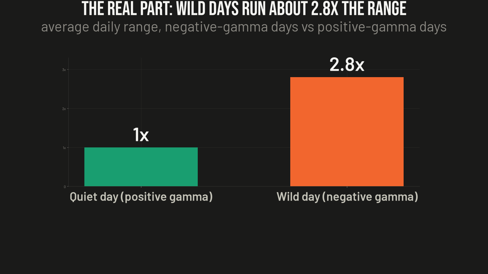
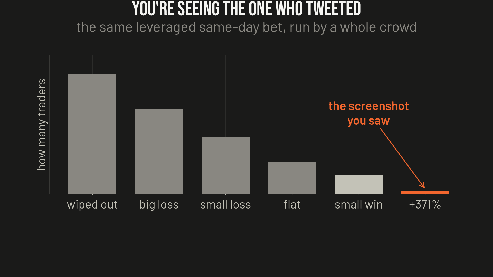

# Ep05 — GEX / Dealer Hedging, the "market cheat code"

**Verdict: half-real. Dealer-gamma genuinely shapes the volatility *regime* (quiet vs. wild) — that read is a real, documented edge. But the "73% price magnet" is overstated and 0DTE-broken, and the $4,200 → $19,800 fortune is leverage + survivorship, not the strategy. Mechanism real, fortune a screenshot.**

A viral thread: a Nashville hotel clerk teaches himself Python, reverse-engineers how options dealers hedge, and claims price homes in on one exact level **73% of the time in the first 45 minutes**. He calls it GEX (gamma exposure), and says he turned **$4,200 into $19,800 in six months** trading it — "pure options, no directional bets."

This one's different from the usual teardown: **there's a real edge buried in here.** So it's a "which half is real" writeup, not an "it's all nonsense" one.

## The half that's real: the vol-regime read

This isn't the author's discovery — it's the **SqueezeMetrics "Implied Order Book" (2018)** framework, commercialized by SpotGamma / MenthorQ and studied academically (Barbon–Buraschi on dealer hedging and price impact). The mechanism:

- When you buy an option a dealer sells it to you, and to stay neutral he is **forced** to buy and sell shares as price moves. That hedging flow is public — you can estimate it from the options chain.
- **Positive net dealer gamma** → dealers hedge *against* the move (sell rallies, buy dips) → volatility suppression, **quiet, range-bound, pinned** days.
- **Negative net dealer gamma** → dealers hedge *with* the move (buy rallies, sell dips) → volatility amplification, **wild, trending, breakout** days.

The **sign and the regime dependence are genuine and documented.** The thread's own numbers (neg-GEX days ~**2.8× the range**, pos-GEX days **63%** closing within 0.5% of the open) are directionally plausible — treat the exact figures as one small sample, but the *direction* is solid.

## The halves that break

**1. The $4,200 → $19,800 is a lottery ticket, not the strategy.** A genuinely market-neutral, delta-managed gamma book **cannot be run in a $4,000 account** — you can't hold delta-neutral structures and rehedge with that capital. At that size you're buying a handful of cheap, often same-day (0DTE), contracts: a convex, **directional** bet with a GEX story stapled on. +371%/6mo is a fat-tail outcome, the same shape as this repo's own [gap-trader finding](../ep02-gap-and-go/) (strip the top few trades and it's negative). One good negative-gamma trend week on leverage explains most of it.

**2. Survivorship.** You see the thread *because it worked*. For every clerk who turns four grand into twenty and posts the screenshot, a long left tail ran the same bet, went to zero, and stayed quiet. The winner posts; the blow-ups delete the app.

**3. The "73% price magnet" is the weakest claim.** The robust, documented effect is on the realized-vol *regime*, not on price homing to one exact strike on a 45-minute schedule. And **all the numbers come from ~60 days of data** — about one OpEx cycle. Nowhere near enough to trust 73% / 2.8× / 63%.

**4. The signal is stale.** It reads yesterday's **end-of-day OI snapshot**, but **same-day (0DTE) options are now >50% of SPX options volume**, and their (enormous, intraday) gamma is largely absent from that snapshot. Real desks rebuild GEX live intraday; a Colab script on overnight OI can't. The classic "read yesterday's OI, trade today's pin" is materially degraded post-2022 vs. the 2018 paper's world.

**5. Even the good version has a short-vol tail.** The positive-gamma "pin" trade is a short-volatility posture: many small wins, occasional large losses — pennies in front of a steamroller (Feb 2018 XIV, Aug 2024 vol spike). And options bid/ask spreads alone flip a 63–73% pin scalp net-negative at retail fills.

## What's realistic

A disciplined, delta-managed **index-options vol-regime overlay** — not a price-prediction system — plausibly earns **Sharpe ~0.7–1.3 (likely 0.5–0.9 net for a retail operator)**, low-double-digit annual returns in good years, with **negative skew and clustered tail losses.** Not +371%/6mo. To capitalize at all you'd need live 0DTE-aware intraday gamma, real dealer-positioning modeling (not the naive call-short/put-long convention), delta-neutral vega-managed structures with explicit tail hedges, institutional execution, and **≥$100k** to run managed structures instead of lottery tickets — and you'd treat it as an overlay on a diversified book, not a system.

**The tell:** the mechanism is so real that giant firms sell it as a monthly subscription to tens of thousands of traders. Which means the easy money got competed away years ago — the famous levels get front-run, and the one piece a regular person can still use (the calm-day-vs-wild-day read) is worth about what a good weather forecast is worth. Useful. Not a fortune.

## For your notebook

GEX is real, but it's a **read on the kind of day, not a magic price level.** Positive gamma → expect calm; negative gamma → expect chaos; size accordingly. Big liquid index, not the high-beta names. Don't trade it like a magnet, don't run it on a tiny account with same-day options, and remember the quiet-day trade is you standing in front of a steamroller picking up pennies.

## Method notes / caveats

- This is a *mechanism + failure-mode* teardown of a viral claim, not a fresh backtest — the source thread published no reproducible code or trade log, and the OI-based GEX estimator requires a live options-chain feed we don't redistribute. The charts illustrate the documented regime effect (neg-gamma ≈ 2.8× range) and the survivorship distribution; treat the specific magnitudes as illustrative-of-direction, and the failure modes (survivorship, ~60-day overfit, 0DTE staleness, short-gamma tail, spread drag, crowding) as the load-bearing findings.
- Sources: X thread by @l1vsun; SqueezeMetrics "Implied Order Book" (2018); SpotGamma / MenthorQ; Barbon–Buraschi on dealer hedging and price impact. Evaluated 2026-07-08.

*Nothing here is investment advice. Not licensed for that. This is one person's read of the public research — could be right, could be wrong. If you find an error, open an issue.*
