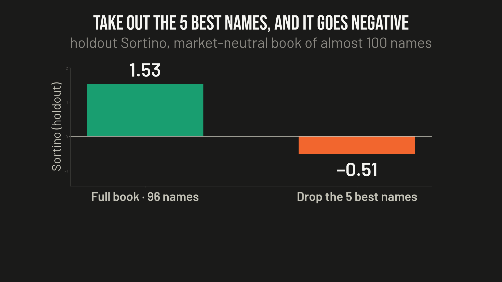
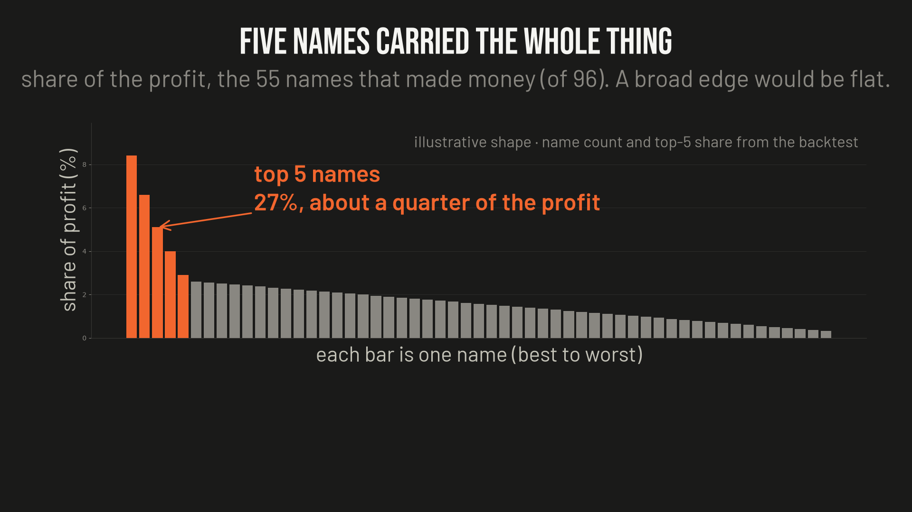

# Ep06 — Market-Neutral Stat-Arb, Built at Home

**Verdict: not at retail. The signal was real — a genuine market-neutral edge that cleared the bar on held-out data, net of double costs. Then deleting the five best names out of 96 flipped it from Sortino 1.53 to −0.51. Five names were the whole edge, nobody could pick them in advance, and the strategy lives at a turnover where you pay the spread the big firms get paid. The keeper is the test, not the strategy.**

This one isn't a viral claim. It's a bot I built myself over two days (2026-07-18 → 07-19) and shelved: the market-neutral statistical arbitrage strategy the large quant funds actually run, rebuilt at a desk, paper first, to be funded only if it held up.

Two rules were set before any signal-hunting: **model the trading costs first**, and **try hard to kill whatever turns up**. The bar never moved: MAR ≥ 0.5 **and** Sortino ≥ 1.0, net of **2× modeled cost**, on an **untouched holdout**.

(Sortino = return measured against the bad days only. MAR = yearly return divided by the worst drawdown.)

## The idea, taken seriously

**Pairs trading** is the baby version. Two stocks that move together for good reasons drift apart; you buy the laggard, short the leader in equal dollars, and wait for the gap to close. Because you're long one and short the other, the market's direction mostly cancels out. You're betting on the gap, not on up or down.

**The grown-up version** (Avellaneda–Lee style) runs it across a whole universe at once: strip out the market and sector factors with a rolling PCA, and bet that each stock's leftover wobble snaps back. No single bet matters. It's the law of large numbers — thousands of barely-tilted coin flips grinding out a return uncorrelated to everything. That's the real thing, not a strawman.

## Attempt 1 — ETF and basket pairs: 15 looked great, 0 survived

- A curated screen of **47 spreads** flagged **15** that stretched wide and looked like they reverted.
- Then the realized test: trade them bar by bar with rolling hedge ratios, no look-ahead, real costs, train/holdout split. **All 15 → 0 cleared the bar.** The best family scored a holdout Sortino of 0.08 at 2× cost.
- Why: gaps that should have closed in ~3–4 weeks took ~6–7 (holds of 42–52 days vs 17–29-day half-lives), the relationships drifted out of sample, and the "family" was really one metals factor.

**A spread that looks stretched says nothing about whether trading it makes money.**

## Attempt 2 — the PCA residual book: a real edge, then a reversal

- The gross signal was real — the only genuine one of the whole build. Holdout Sortino ~1.1–1.3 before costs.
- The first net-of-cost verdict said **fail**. That verdict was **wrong**: spreads were being estimated (Corwin–Schultz), and the estimates were garbage for about a third of the names — a mean of 21.5 bps, one name estimated at 108 bps against roughly 27 real.
- With **measured** spreads from real consolidated quotes (~6 bps), it flipped to a borderline **pass**: holdout Sortino **1.53**, MAR **0.94**, net of 2× cost. It also survived a replay with year-by-year measured spreads back to 2020.

That "pass" was stated too confidently at the time. It should have read *clears the threshold, untrusted until it survives a beating.*

## The test that matters: delete the five best names

If an edge is genuinely broad, removing 5 names out of 96 barely moves it. This one didn't shrug.

- **Sortino 1.53 → −0.51.** Not a bit worse — an actual loss.
- Only **55 of 96** names were net-positive. The **top 5 were 27%** of the positive P&L.
- Dropping 10 names at random passed in only 5 of 15 draws.

*The concentration chart is an illustrative shape: the per-name split wasn't saved, but the name count and the top-5 share are the measured figures.*

## Could you just trade the five winners? No.

- Winners didn't persist from the training period into the holdout (rank correlation **−0.12**; last period's top 15 did *worse* than its bottom 15).
- No feature picked them in advance. The best candidate, idiosyncratic volatility, predicted how *big* a name's P&L would be, not which *direction* — which is exactly where the fragility comes from.
- A filtered 12-name book scored Sortino 0.73 — the **55th percentile of random 12-name books**. Concentrating was worse than the full book (0.73 vs 0.97) with **twice the drawdown**.

## Why it stays theirs

1. **The cost wall.** The edge lives at high turnover. Every trade crosses the spread, and at retail that toll rivals the edge per trade. Institutional desks clear it with sub-basis-point costs — co-location, internal crossing, being *paid* to provide liquidity. Same trade, opposite side of the cost.
2. **Breadth.** Real stat-arb is thousands of small, weakly correlated bets. An edge carried by five names is the opposite of that, and it's why this one was fragile.

The only retail lever that could flip the cost sign is passive, liquidity-providing execution — earning the spread instead of paying it. It's a long shot (that's exactly where slow traders get picked off) and it needs live fill data no backtest can supply.

## For your notebook

**A backtest that passes is weak evidence. One that survives you trying to kill it is strong evidence.** Before you believe any backtest, yours or anybody else's, delete the five best trades or the five best names and run it again. If the edge dies, you never had one. Pair it with a random-subset control so you can tell a real signal from the base rate of a small, lucky book.

It's the same shape as the [gap-and-go trader](../ep02-gap-and-go/), where three trades were 92% of the profit, and the [51% → $100B math](../ep04-rentec-51pct/): real numbers, carried by a tiny handful of draws.

## Method notes / caveats

- **Universe:** 96 liquid US large caps that exist today, 8 years of daily data. That's survivorship-biased and therefore *optimistic* — a reversion book is exactly what delisted blow-ups hurt. The free breadth test already rejected it, so a survivorship-safe dataset wasn't bought.
- **Costs:** volatility-aware square-root impact plus spread, borrow, and slippage; everything above is at **2×** those costs. Spreads were measured from consolidated (SIP) quotes, including a year-by-year replay.
- **Multiple testing:** trials were counted from day one; the ETF result (0 of 15) needs no correction, and the single-name "winner" features were checked against a Bonferroni bar (none passed).
- **What's not here:** the research code isn't published in this folder. It runs on a paid consolidated-quote feed that can't be redistributed, and the holdout is spent. The figures come from the project post-mortem written the day it was shelved, 2026-07-19.
- **What survives from the build:** a cost-first, default-to-reject testing rig. Capital stays with the one strategy that clears the bar.

*Nothing here is investment advice. Not licensed for that. This is one person's research — could be right, could be wrong. If you find an error, open an issue; corrections get pinned.*
