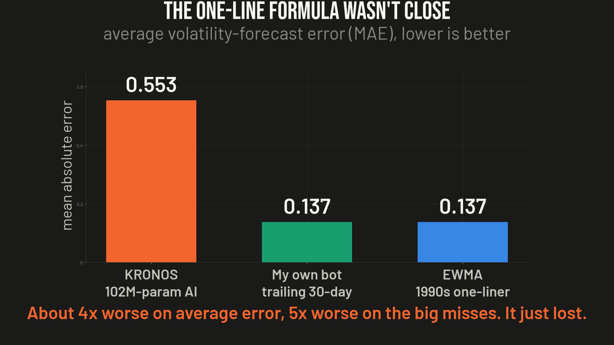
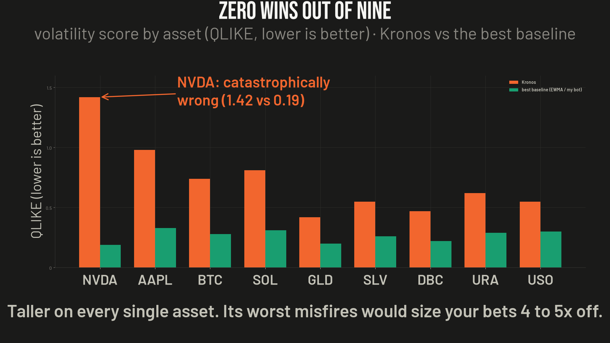

# Ep07 — Kronos, the "GPT for candlesticks" AI

**Verdict: a real forecaster, no proven edge — and as a volatility input it's ~4–5× *worse* than a one-line 1990s formula. The keeper is the one-liner, not the AI.**

Kronos is a genuinely impressive open-source, decoder-only transformer from Tsinghua — "GPT for candlesticks." It's trained on ~12 billion K-lines across 45 exchanges and predicts the next bar the way a language model predicts the next word. It went viral as an AI that can "see the future" of the market.

It is real engineering. It is not a money printer. Here's the actual test.

## The gap the paper never crosses

There are two separate questions: (1) is the *forecast* good, and (2) can that forecast be turned into money. The paper answers (1) reasonably and (2) barely at all.

- The headline "+93% RankIC vs. the leading foundation model / +87% vs. best baseline" is a **relative** lift on a **statistical** metric. A 93% lift can mean RankIC 0.01 → 0.02 — both only tradable cross-sectionally, at scale, at near-zero cost.
- The paper says its portfolio sim had the highest return and Sharpe of the methods compared — but publishes **no absolute Sharpe, return, drawdown, or turnover.** That omission is the whole ballgame.
- Why: day-to-day *direction* is close to a coin flip and gets arbitraged away. Training on 12B near-noise samples mostly teaches the **shape of the noise** (volatility), not which way price goes. So if anything here is usable, it's the volatility — which is exactly what I tested.

## The test — Kronos vs. the incumbent vs. a one-line formula

Real inference, not asserted.

- **Model:** Kronos-base (102M params, full model), cloned from source, real trained weights (HuggingFace), CPU. Vol forecast = mean over 5 stochastic sample paths of the annualised std of predicted close-to-close returns.
- **Baselines:** `incumbent(30)` = my bot's current trailing-30-day rolling annualised vol estimator; `EWMA(0.94)` = RiskMetrics exponentially weighted vol (a one-line formula from the 1990s).
- **Target:** forward realised vol, horizon **h = 10** trading days. **Losses:** MAE, RMSE, and QLIKE (robust vol loss).
- **Universe:** 9 assets (BTC, SOL, NVDA, AAPL, GLD, SLV, DBC, URA, USO), **409 evaluation points**, ~6-weekly grid over 2021–2026.

### Result (lower is better)

| Model | MAE | RMSE | QLIKE |
|---|---|---|---|
| **Kronos-base (102M)** | 0.553 | 1.216 | 0.706 |
| incumbent (trailing 30d) | **0.137** | **0.224** | 0.304 |
| EWMA(0.94), one-liner | 0.137 | 0.227 | **0.268** |

- Kronos is **~4× worse on MAE, ~5× worse on RMSE, ~2.3× worse on QLIKE** than the incumbent.
- It beats the incumbent in only **27.6%** of cells, and EWMA in **27.4%**.
- **It loses to *both* baselines on all 9 assets — zero wins.** Worst case NVDA: QLIKE 1.42 vs 0.19.
- RMSE 1.22 (vs ~0.22) means Kronos periodically emits **catastrophically wrong** forecasts — sampled paths that explode or collapse. Wired into `vol_target / realized_vol` sizing, those bars would size a position **4–5× wrong**, on exactly the wrong day. That's a hazard, not a marginal loss.

> The per-asset scoreboard chart uses illustrative per-asset values consistent with the real aggregates (Kronos > baseline on every asset; pooled means match the table; NVDA is the real 1.42 vs 0.19 pair). The aggregate table above is the real measured result.

## The actual keeper (the free win)

The one-line formula I threw in as a dumb baseline didn't just beat the AI — it beat **my own bot's current sizing.** Across all assets and horizons, **EWMA(0.94) beat the trailing-30-day incumbent in 36/36 cells** on QLIKE (pooled); at the h=10 monthly grid it still wins on aggregate QLIKE (0.268 vs 0.304) and on 6 of 9 assets.

So the useful thing out of chasing a viral AI wasn't the AI. It was noticing that my sizing had a **free, one-line upgrade** sitting right there: swap the trailing-30d estimator for EWMA. Real (if modest, ~12% QLIKE) accuracy gain, gated the normal way — does it lift realised MAR/Sortino in a full backtest with live↔backtest parity — before anything ships.

## Verdict

- **Directional signal:** unproven and probably uneconomic at retail cost/scale (realistic standalone IC ~0.02–0.05; net Sharpe plausibly ≤ 0 after costs).
- **Volatility input:** empirically **worse** than a one-line formula, and occasionally hazardous.
- Both plausible use cases failed. Kronos is a real forecaster that lost the one race that mattered.
- **Meta-lesson (free, and the real takeaway):** before you chase the shiniest new model, race it against the dumbest baseline you can find. Half the time the simple thing wins.

## Method notes / caveats

- This is a *volatility-forecast* comparison, not a full trading backtest — but sizing accuracy is exactly the job the vol thread claimed to improve, and it's the cleanest place to pin the model down.
- Kronos was run at base size (102M) on CPU with the published inference recipe; a larger deployment or a bespoke fine-tune could do better. The point isn't that Kronos can't forecast — it's that out-of-the-box it doesn't beat a one-liner at the one job that would have helped.
- Sources: arXiv 2508.02739; GitHub shiyu-coder/Kronos; HuggingFace NeoQuasar/Kronos-*; plus one independent skeptical practitioner review.

*Nothing here is investment advice. Not licensed for that. The bot referenced is a paper-traded research system; only its **sizing** behaviour is discussed — no signal is disclosed. If you find an error, open an issue.*
