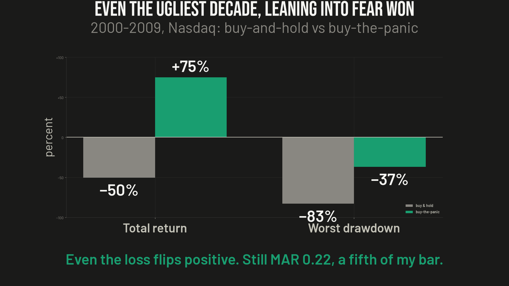
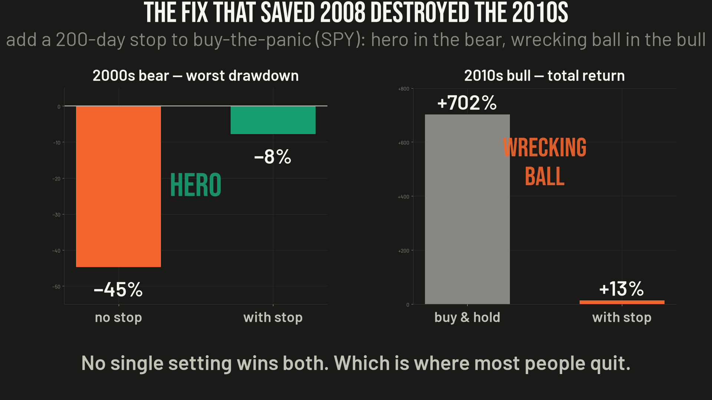
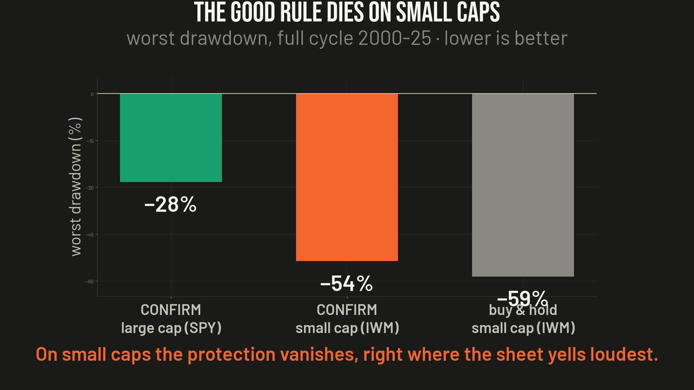
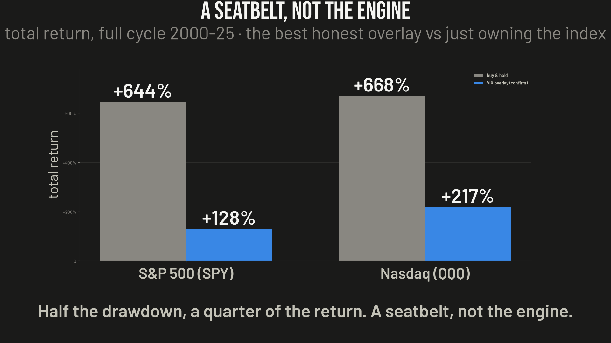

# Ep08 — The Viral "VIX Cheat Sheet"

**Verdict: half-true. "Buy the panic" is a real, durable edge — but it's a seatbelt, not an engine. The best honest version halves your drawdown, loses to buy-and-hold on return, and never clears the bar I hold my own bots to. "Sell when the VIX is calm" is a coin flip. "Make millions" is false.**

A trading account went viral with a one-number "cheat sheet": when the VIX (the market's fear gauge) spikes above 35, buy aggressively; when it drops under 15, sell. *"This is all you need to make millions in the stock market."* Screenshot it, get rich.

I took the only defensible leg — buy the panic — and stress-tested it on real VIX + SPY/QQQ/IWM data across the 2000–09 secular bear, the 2010–25 low-vol bull, and the full 25-year cycle. Long-only, cash earns 0% when flat (conservative), 5 bps/side. Then I built the entry/exit/sizing rules the sheet never specifies, and swept instruments and costs.

## Two legs: one real, one a fallacy

- **Buy-the-spike (VIX ≥ 35) is genuine edge.** VIX is one of the most mean-reverting series in finance; spikes above 35 are rare and short-lived. They coincide with margin calls and forced deleveraging — price-insensitive selling that overshoots and reverts. You get paid to supply liquidity when everyone wants out. This leg is directionally real.
- **Sell-below-15 is a textbook base-rate fallacy.** "Every selloff was preceded by low VIX" confuses P(low VIX | selloff) with P(selloff | low VIX). The market sits under 15 most of the time, so *of course* the calm came first — every car crash was also "preceded by driving." Low VIX can persist for years (2017, H2-2019, 2021, 2024), and those are exactly the grind-up years where the money is made. Selling into calm pulls you out of the best up-years of the very window the sheet uses to sell it to you.

## The catch the sheet never mentions: no exit, no size

"Aggressively" is a vibe, not a parameter. The sheet has no holding rule, no position size, no drawdown control — so I had to build them.

### The lost decade (2000–2009): the core instinct survives

If you bought and held the Nasdaq through the 2000s you lost about half your money (QQQ buy-and-hold **−50.3%**, max drawdown **−83%**). Buy-the-panic flipped that positive — **+21% to +131%** depending on the exit — and cut the worst drawdown into the **−33% to −40%** range. Leaning into fear beat holding blindly through a secular bear. That part is real.

But it still didn't clear the bar (best 2000s MAR ≈ **0.22** vs. the **0.5** I require), and it walked straight into the second half of 2008: the VIX crossed 35 in September and the market fell another ~40% into March. The spike is not the bottom, and a rule with no exit silently assumes infinite money and patience.

### The stop that saved 2008 wrecked the 2010s

Obvious fix: buy the panic, but cut it if price loses its 200-day trend line. In the 2000s bear it was the single biggest improvement in the study — SPY max drawdown **−44.7% → −7.8%**, MAR **0.05 → 0.33**. Then I ran the exact same stop through the 2010s bull: buy-and-hold made **+702%**, the stop made **+12.9%**. In a fast bull every scare V-recovers in weeks, and the stop ejected me at the bottom of every dip, right before the bounce.

**No single parameterization wins both regimes.** The exact device that saves you in a real bear is poison in the fake ones.

## The fix that actually works: confirm, don't catch

The all-weather version doesn't buy the panic and doesn't use a stop. A VIX spike merely *arms* the setup; you enter **only when price closes back above its 200-day** — you buy the recovery, not the falling knife. It never has to guess which regime it's in; it waits for price to confirm.

Full cycle 2000–2025, plain **CONFIRM** on large caps:

| | SPY | QQQ | vs. Buy & Hold |
|---|--:|--:|---|
| Total return | +128% | +217% | **loses** (BH +644% / +668%) |
| Max drawdown | −28% | −33% | **wins** (BH −55% / −83%) |
| MAR | 0.11 | 0.14 | ~tie (BH 0.15 / 0.10) |
| Ship bar (MAR ≥ 0.5) | ✗ | ✗ | — |

It roughly **halves buy-and-hold's drawdown** and is the only overlay that's competitive in both regimes — but it gives up most of the compounding to do it. A seatbelt, not the engine.

## Both of the sheet's loudest instructions are net-negative

- **"Buy high-beta small caps aggressively"** is where the good rule *breaks*. Run CONFIRM on IWM and the crash protection vanishes: full-cycle drawdown **−53.7%**, essentially identical to buy-and-hold IWM (−58.6%). Noisier index → false 200-day reclaims → CONFIRM buys the head-fake in late 2007 and rides IWM down ~54% through 2008. The single most emphatic instruction on the sheet is exactly where its salvageable core performs worst.
- **"Trade aggressively" (adding an in/out stop) is pure harm on the clean large caps** where the rule actually works. On SPY/QQQ, CONFIRM+STOP lowers return, halves-or-worse the MAR, and collapses win rate to ~30–42% in *every* window — it even makes QQQ's drawdown worse (−33% → −45%). The stop patches a problem large caps don't have.

## The seatbelt, not the engine

Over the full cycle the best honest overlay cut drawdown in half **and** cut total return by more than half (+128%/+217% vs. +644%/+668%). It's in cash ~70% of the time, dodging crashes and forfeiting the compounding. And the humbling footnote: over 2010–2025 the one strategy that would have cleared the bar (MAR ≥ 0.5) was **just buy-and-hold QQQ** (MAR 0.53). Every clever VIX overlay lost to owning the index in one click.

## It's cost-immune — and that doesn't save it

~1.1 round-trips/year on the two most liquid ETFs on earth. At a realistic 1 bp/side the CAGR drag is −0.02 pp/year and MAR is unchanged; even a pessimistic 25 bps barely moves it. The sub-0.5 MAR is **structural** (mostly in cash, misses the bull), not frictional. You can't cost-optimize your way to a better verdict — but the modest edge that exists survives execution fully.

## The meta-lesson

The edge is real, durable, and **completely known** — taught on every volatility desk on day one. Precisely because everyone knows it, the price already reflects it. It's worth what sensible rebalancing is worth (a little), not what a money printer is worth. A famous edge is a priced-in edge. The stuff that makes millions doesn't arrive on a screenshot with a share button.

**For your notebook:** after a VIX panic, wait for the S&P to reclaim its 200-day, then hold until the fear drains. Big index, no stop, no small caps. It cuts your worst crash roughly in half — a real, useful rule that will not make you rich, but might keep you from getting poor at the wrong moment.

## Method notes / caveats

- Long-only, cash@0% when flat (understates the strategy — it's in cash most of the time and real T-bills paid 2–4%). Fills at signal-day close, 5 bps/side base. Data: `^VIX`, `SPY`, `QQQ`, `IWM` (auto-adjusted). Metrics: total return, CAGR, max drawdown, **MAR (CAGR/MaxDD)**, Sortino, Sharpe, win rate, profit factor.
- Trade counts are thin (3–35 per variant per window). Treat the *sign and the drawdown behavior* as the robust findings, not the specific CAGRs — changing an exit threshold can swing a point estimate materially on ~14 trades. The conclusions rest on structure (regime-dependence, drawdown-halving, cash drag), which is stable across the sweep.
- Ship bar throughout: **MAR ≥ 0.5 and Sortino ≥ 1.0** on the validation window — the same bar my own paper-traded research bots must clear. No version of this overlay clears it (best full-cycle MAR 0.14).
- Source: single-variable VIX-regime overlay, evaluated 2026-07-09.

*Nothing here is investment advice. Not licensed for that. The bots referenced are paper-traded research systems; only sizing/overlay behaviour is discussed — no signal is disclosed. If you find an error, open an issue.*
