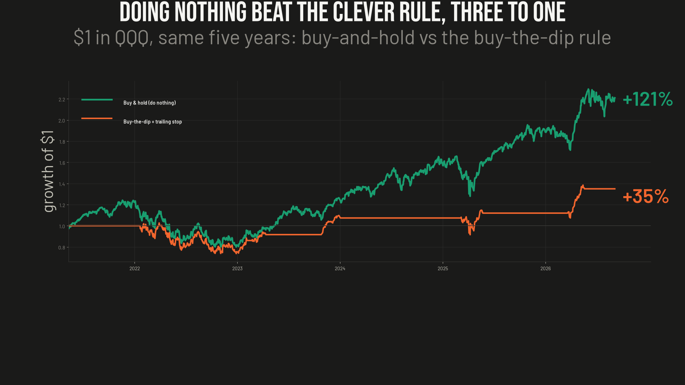

# Ep09 — "Buy QQQM Below Its 200-Day, Trail Out With a 2% Stop"

**Verdict: it's a real, sensible-sounding rule — and buy-and-hold beats it, badly. Over a full Nasdaq-100 cycle the dip-buy-and-trail rule returned +35% while just owning the index returned +121%. It wins the vanity stats (83% win rate, 3.5 profit factor) and loses the only one that matters — the money. Time in the market beats timing the dip.**

The rule doing the rounds on retail finance forums: don't just buy and hold the Nasdaq — be *smart* about it. Wait for a dip below the 200-day trend line to buy, then once it recovers, protect your gains with a 2% trailing stop. Sit in cash the rest of the time. It sounds disciplined. It sounds like risk management. It loses to doing nothing.

I coded the rule exactly as specified and ran it against buy-and-hold on QQQ (the Nasdaq-100, used as the longer-history twin of QQQM — same index) over a full cycle: the 2022 bear, the 2023-24 recovery, and 2025.

## The rule, exactly as tested

- **Entry:** while in cash, buy at the close on any day the price closes *below* its 200-day EMA (the "dip").
- **Arm:** once you're long, arm a trailing stop the first day price closes 2% or more *above* the 200-day EMA (i.e. once it has "recovered").
- **Exit:** after the stop is armed, track the running peak and sell when price falls 2% below that post-recovery high. Go to cash, wait for the next dip below the 200-day.

Single position, long-only, fully invested when in, 0% on cash when out.

## Results (QQQ, 2021-05 → 2026-09)

| Metric | Dip-buy + trail | Buy & hold |
|---|--:|--:|
| Total return | **+35.0%** | +121.0% |
| CAGR | 5.81% | 16.12% |
| Max drawdown | −28.2% | −35.6% |
| **MAR** (CAGR/MaxDD) | **0.21** | 0.45 |
| **Sortino** | **0.62** | 1.13 |
| Time in market | 32% | 100% |
| Profit factor | 3.46 | — |
| Win rate | 83% (5/6) | — |
| Avg hold | 105 d | — |

**KPI bar (MAR ≥ 0.50 AND Sortino ≥ 1.00): FAILED** — and it isn't close. It loses to buy-and-hold on *both* absolute return and every risk-adjusted measure. The slightly shallower drawdown (−28% vs −36%) is the one thing it buys you, and it costs you two-thirds of the return to get it.

## Why it fails — structural, not a tuning miss

**1. It's in cash about two-thirds of the time, and the Nasdaq trends up.** Entry only fires when price is *below* the 200-day — which, on a secular-uptrend index, is the minority of days. So the strategy is sitting in cash through exactly the long grinds *above* the trend line, which is when the index does its compounding. You can't collect a 16%/yr trend while you're 68% absent for it. No 2%-vs-3% trailing-stop tweak fixes being out of the market for the climb.

**2. The 83% win rate and 3.5 profit factor are a mirage.** Five of six round-trips were green, and gross wins were 3.5× gross losses — by the usual retail scorecards this looks like a *great* system. It still lost by a mile. Win rate and profit factor measure the *percentage* of trades that worked; they say nothing about how much capital was actually captured. A pile of small, clean green trades while you're flat during the big up-moves is a high win rate on a small base. **Measure the money you captured, not the share of trades that were green.**

**3. The trailing stop protects the wrong side.** The stop only *arms* after the position has recovered 2% above the 200-day — so there is no downside protection on the *entry* side at all. You buy the dip and then have to sit, unhedged, through however much further it falls before it can recover. In this window the 2022-04-06 entry did exactly that: it bought into the bear and sat **306 days at −14%**, waiting ~10 months for a recovery to EMA+2% before the trailing stop could even switch on. A dip-buyer with no stop on the entry side carries open-ended downside during a bear — which is precisely when you'd want protection.

The underlying tension: **buying below the 200-day is a mean-reversion bet, and the Nasdaq-100 trends rather than mean-reverts.** The rule is structurally mismatched to the thing it's trading.

## The salvage

There isn't a parameter that rescues this, but there is a lesson, and it's the oldest one: **time in the market beats timing the dip.** The boring version — a plain dollar-cost-averaging, never-sell accumulator that just keeps buying and never tries to be clever about when — wins here precisely because it's never absent for the climb and never gets faked out of a trend. Every layer of "discipline" this rule adds (wait for the dip, arm a stop, trail out) is another way to be out of the market during the part that pays. The complexity is the problem, not the solution.

## Method notes / caveats

- Long-only, single position, fully invested when in, **0% on cash when flat** (conservative — real T-bills paid 2-4% over this window, which would help the strategy a little, but not remotely enough to close a +35% vs +121% gap). Fills at the signal-day close, no commission or slippage modeled (also flatters the strategy). Buy-and-hold is measured over the identical window, starting the day the 200-day EMA first exists so both books see the same bars.
- Data: Alpaca free **IEX** daily bars, split-adjusted. IEX history only reaches ~mid-2020, so the usable window is ~5 years — but it contains a complete cycle (2022 bear → 2023-24 recovery → 2025), which is the relevant stress. QQQM and QQQ track the same Nasdaq-100 index; QQQ is used as the longer-history twin and the two give near-identical results.
- Trade count is thin (6 round-trips), so treat the *structure* — cash drag, the win-rate mirage, the unhedged entry side — as the load-bearing finding, not the third decimal of any single CAGR. The structure is what's stable, and it's what sinks the rule.
- KPI bar throughout: **MAR ≥ 0.5 AND Sortino ≥ 1.0** on the validation window — the same bar this project holds its own paper-traded research systems to. This rule clears neither.
- Reproduce it yourself: [`backtest_ema_trail.py`](backtest_ema_trail.py) needs only your own Alpaca market-data key (`ALPACA_KEY` / `ALPACA_SECRET` env vars, free IEX feed). Source rule evaluated 2026-06-18; results above from a fresh re-run.

*Nothing here is investment advice. Not licensed for that. This is one person's research — could be right, could be wrong. If you find an error, open an issue.*
