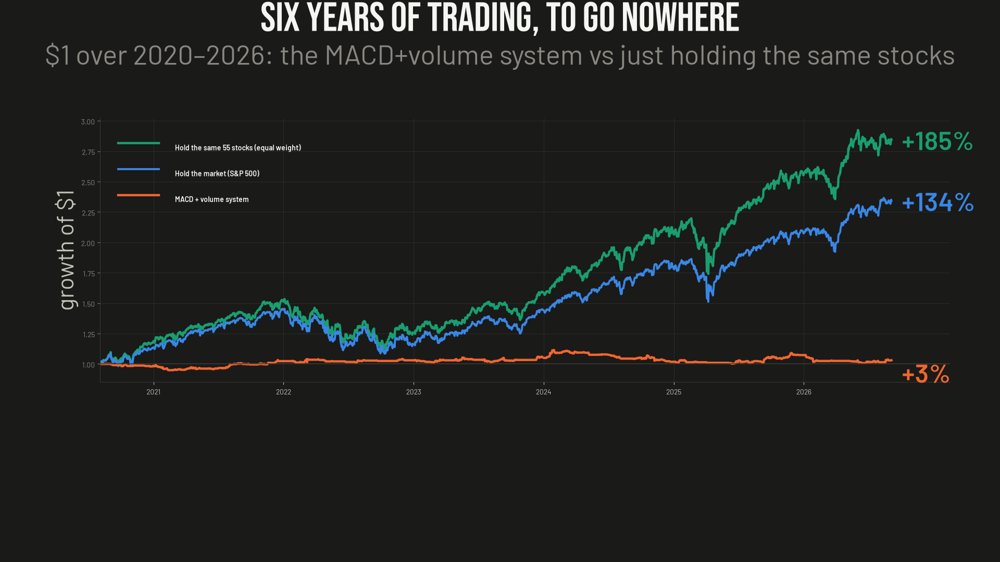
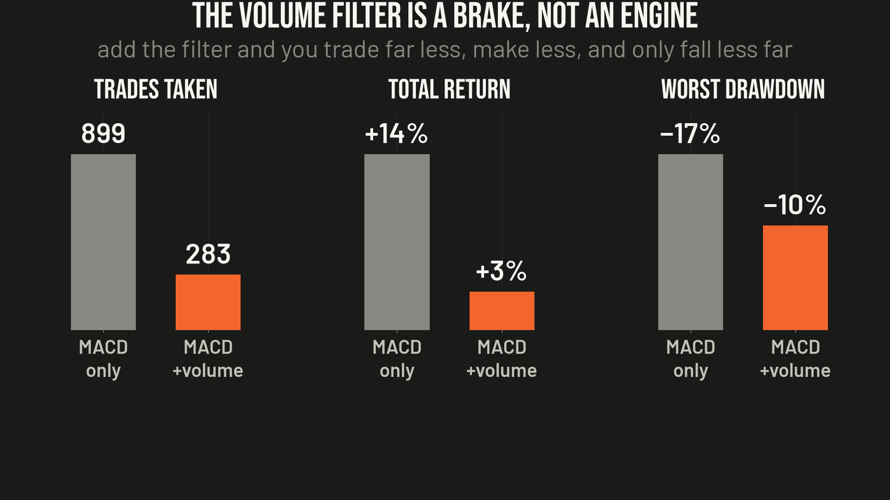

# Ep10 — MACD + the "Profitability Multiplier" Volume Filter

**Verdict: the most-taught momentum setup on the internet, upgraded with the volume filter everyone swears by, earns ~0% net of cost over six years. The famous volume "multiplier" didn't multiply anything — it took a 1.07 profit factor to 1.05 while cutting two-thirds of the trades. What it actually does is shrink the drawdown. It's a brake, not an engine.**

The pitch is everywhere on trading YouTube: the raw MACD crossover is basically a coin flip, so only take the crossover when that day's volume is way above normal — real money behind the move — and *that's* the thing that finally makes it profitable. One writeup literally called the volume filter "the profitability multiplier." I coded the exact system and tested that claim.

## The rule, exactly as tested

- **Entry (all true on the decision close):** bullish MACD (12/26/9) histogram cross negative→positive; regime OK (cross at/above zero, or close > rising EMA50); **RVOL = volume ÷ 20-day-avg-volume ≥ 1.5** (the conviction gate); close in the upper half of the bar's range.
- **Exit (asymmetric):** structural stop below the 10-day swing low with a 1.5×ATR(14) risk cap; ATR trailing stop ratchets up under the running high; bearish MACD cross *on elevated volume* = exit; decay stop (held > 60d, not in profit, RVOL collapsed).
- **Sizing:** fixed-fractional, 0.75% equity risked per trade, up to 12 parallel names, single position ≤ 15% of equity. Scale by adding names, not concentrating.
- **Cost:** 5 bps one-way base (~10 bps round-trip); cost test also runs 0× and 2×.

## Results (55 liquid US large-caps, 2020-08 → 2026-09, ~6.1 yrs)

| Metric | **MACD + RVOL** | Buy & Hold SPY | Buy & Hold EW-universe |
|---|--:|--:|--:|
| Total return | **+3.0%** | +134.3% | +184.5% |
| CAGR | 0.5% | 15.0% | 18.8% |
| Max drawdown | −10.1% | −25.4% | −26.4% |
| **MAR** (CAGR/MaxDD) | **0.05** | 0.59 | 0.71 |
| **Sortino** | **0.12** | 1.28 | 1.51 |
| Profit factor | 1.05 | — | — |
| Win rate | 37.8% | — | — |
| Trades | 283 | — | — |
| Time in market | 59% | 100% | 100% |

**KPI bar (MAR ≥ 0.50 AND Sortino ≥ 1.00): FAILED** — by an order of magnitude. It captured essentially none of a +134% market.

## The headline: RVOL did not multiply anything

The doc's central claim is that the volume filter lifts profit factor above 1. Run both books on the identical stocks and window:

| | Total ret | MAR | Sortino | PF | Trades |
|---|--:|--:|--:|--:|--:|
| MACD-only (no RVOL) | +13.8% | 0.13 | 0.39 | **1.07** | 899 |
| MACD + RVOL ≥ 1.5 | +3.0% | 0.05 | 0.12 | **1.05** | 283 |

Profit factor was already 1.07 *without* the filter and dropped to 1.05 *with* it. Adding the gate cut trade count by ~69% and *lowered* return, MAR, and Sortino. Its one real effect is a tighter drawdown (−17% → −10%). That is a **trade-count / exposure reducer — a brake — not a profitability multiplier.**

## Kill-tests

**Drop-top-5 — the "profit" is five names.** Total net trade P&L over the window: **+$3,007**. The top-5 names made **+$15,489**; the other 49 names *lost −$12,482 combined*. Remove 5 of 55 (MS, MRK, AMD, ABBV, NVDA) and the whole system flips to **−10.6%** (MAR −0.12). A broad edge shrugs that off; this one *is* the five names — a lottery, not an edge.

**Cost sensitivity — the edge is thinner than the spread.** Frictionless it makes +7.5% (still fails the bar, MAR 0.13). At the realistic 5-bps base, +3.0%. At 2× cost it goes **net-negative (−1.1%)**. A ~28-round-trip-per-year system can't afford itself; round-trip friction erases the entire gross signal.

**Robustness sweep — 0 of 12 pass.** Three MACD speeds × four RVOL thresholds. The default 12/26/9 row hovers at zero. The only pulse is the fast 8/21/5 row (best cell MAR 0.41 / Sortino 0.67 at RVOL 1.5) — but even the best of 12 falls short of the bar and its neighbours are erratic (0.11 → 0.41 → 0.31 → 0.42). A lone bump, not a plateau. Picking it would be curve-fitting to noise.

## Why it fails (structural, not a tuning miss)

1. **No net edge in the signal.** A MACD bullish cross on a liquid large-cap is a lagging, high-frequency event. Gross of cost the whole family barely clears break-even; net of realistic cost it's flat-to-negative. There's no positive expectancy for a volume gate to "multiply."
2. **It behaves correctly and still loses.** It sits out 41% of the time and caps drawdown at −10% — exactly the disciplined behaviour it promises. But on a market that ran +134%, being flat and taking 8-day nibbles means it misses the trend it's supposed to ride.
3. **Concentration masquerading as edge.** The only reason the headline isn't negative is five names. The median name loses, so "add uncorrelated names to smooth the curve" dilutes the few winners instead of compounding an edge.
4. **Turnover vs. a thin edge.** ~28 round-trips/year at 8-day holds is enough turnover that a 10-bps round-trip erases the whole gross signal. Momentum at this frequency is structurally cost-fragile.

## The salvage (what's worth keeping)

- **A confirmation filter can only remove trades.** Volume, a second indicator, anything — it can never invent an edge that wasn't in the underlying signal. So prove the raw signal has an edge *first*, before you decorate it. Everyone does it backwards.
- **RVOL is a real drawdown/exposure throttle** (−17% → −10%), worth remembering as a *risk-control* tool — and emphatically not the "profitability multiplier" it's sold as.
- **If this is ever revisited, faster MACD (8/21/5) is where any residual pulse lives** — not the canonical 12/26/9. It still doesn't clear the bar; do not deploy on a single-cell peak.

## Method notes / caveats

- Data: Alpaca free **IEX** daily bars, split-adjusted, read-only (no live system touched). The IEX feed reports only IEX-exchange volume (~2–3% of consolidated); the RVOL *ratio* is unaffected (numerator and 20-day baseline share the same scale), so an absolute share/$ floor is set to 0 and the pre-screened liquid universe *is* the liquidity filter. This is the faithful implementation (283-trade base); an absolute floor would mis-scale and wrongly drop ~85% of signals — itself a "broken gate" artifact.
- Benchmarks measured over the identical window: buy-&-hold SPY and equal-weight buy-&-hold of the same 55 names.
- KPI bar throughout: **MAR ≥ 0.5 AND Sortino ≥ 1.0** — the same bar this project holds its own paper-traded research to. This clears neither.
- Reproduce it yourself: [`backtest_macd_rvol.py`](backtest_macd_rvol.py) is self-contained and needs only your own Alpaca market-data key (`ALPACA_KEY` / `ALPACA_SECRET` env vars, free IEX feed). It prints the base table, the drop-top-5 and cost tests, the sweep, and the RVOL isolation.

*Nothing here is investment advice. Not licensed for that. This is one person's research — could be right, could be wrong. If you find an error, open an issue.*
