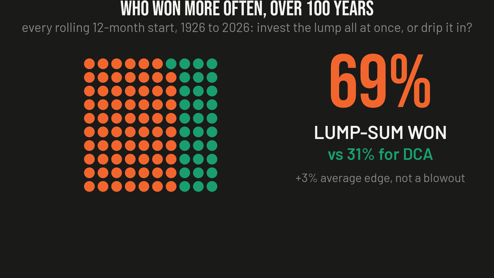
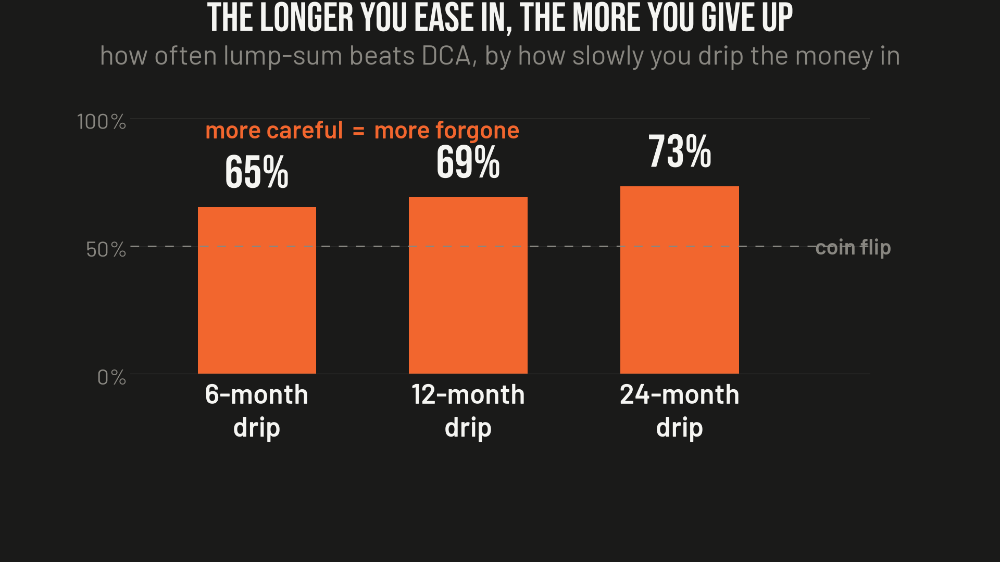

# Ep11 — Dollar-Cost Averaging vs. Lump-Sum

**Verdict: dollar-cost averaging a lump you already have is the "responsible" advice everyone gives, and on 100 years of data it loses. Investing it all at once beat easing it in about 69% of the time (~2 of 3), by ~3% on average. DCA isn't an alpha strategy or a scam — it's a seatbelt. It doesn't make you richer, it caps how much unlucky timing can cost you. Lump-sum wins the money contest; DCA wins the sleep contest.**

You come into a windfall — a bonus, an inheritance, a sale — and the standard advice is: don't dump it all in at once, ease in over the year, average your way in. That's dollar-cost averaging (DCA), sold as the safe, grown-up move. So I tested it against the alternative (lump-sum, LS: invest it all today) on a century of real returns.

## The test

- **Data:** Ken French monthly US total-market return (Mkt-RF + RF, dividends included) + the 1-month T-bill, **1926-07 → 2026-07** (1,201 months). The [CSV is included](ff_factors_monthly.csv); the [code](dca_lumpsum_backtest.py) is standard-library only, no credentials, no downloads.
- **The question, at every rolling start month:** invest the lump all at once, or drip it into equal monthly buys over N months?
- **The fair part (the one most studies skip):** the DCA cash that hasn't been deployed yet earns the **T-bill** rate each month. Pretending it earns 0% unfairly inflates lump-sum's edge. Both versions are reported below.
- The LS/DCA relative result locks in at the end of the deployment window (after that both are fully invested), so terminal wealth is measured at month N.

## Headline (12-month DCA — the most common recommendation)

| | Fair (cash earns T-bill) | Naive (cash earns 0%) |
|---|--:|--:|
| **Lump-sum wins** | **69.1%** of all rolling windows | 73.4% |
| Avg LS edge | **+3.31%** (median +4.03%) | +4.79% |
| When LS wins | avg +8.6% | +9.5% |
| When DCA wins | avg +8.6% | +8.3% |

Lump-sum wins about **two out of three** starts across a century. It doesn't win *bigger* — the LS-win and DCA-win margins are both about the same size. It wins **more often**, because the market is up more months than it's down, and cash waiting on the sidelines is cash that isn't compounding.

**The catch both sides play:** about 4 points of "lump-sum wins" and ~1.5% of the edge is just DCA's cash sitting at 0%. Let it earn T-bills, as anyone would, and LS's edge shrinks from +4.8% to +3.3%. Each camp quotes whichever version flatters its argument.

## The longer you drip, the more you give up

| DCA period | Lump-sum win rate | Avg LS edge |
|---|--:|--:|
| 6 months | 65.2% | +1.46% |
| **12 months** | **69.1%** | **+3.31%** |
| 24 months | 73.3% | +7.03% |

Counter-intuitive but clean: "DCA harder" (spread it over longer) makes lump-sum win *more*, because you forgo even more market exposure. Being extra careful just quietly costs you extra.

## When DCA actually wins (and what it's for)

DCA's wins cluster exactly where you'd fear — deploying a lump right into a top. The worst 12-month starts for lump-sum were **1929, 1931, 1937, 2008**; in 1931, in the guts of the Depression, easing in beat going all-in by 40-44%. But you never know you're at a top until it's a memory.

That points at the one thing genuinely worth keeping: **DCA is sequence-risk insurance, not a return strategy.** Lump-sum's worst first-year drawdown in the whole record was **−65.7%** (1931); the median is −7.9%. Easing in caps that, because only a slice of your cash is exposed in month one, ramping to full by month N. It's a seatbelt: it doesn't make the car faster, and it's a terrible thing to sell as a bigger engine. If going all-in would make you panic and sell at the bottom, easing in over 6-12 months is a rational premium to pay for not blowing yourself up. Just know that's what you're buying.

## The confusion the whole debate runs on

Two different things wear the name "dollar-cost averaging," and people argue past each other:
1. **DCA a lump you already have** (what's tested here): usually *worse* than investing it now. A real choice, and on the numbers it costs you a little.
2. **Invest each paycheck as it lands:** not a strategy you're picking over lump-sum — you don't *have* the lump. It's just investing, it's correct by default, and it needs no defending. When someone says "DCA always wins," they've almost always switched to this second meaning, where there was never a contest.

## Verdict

**Lump-sum wins the money contest (~2 of 3, ~+3% on average, fairly measured); DCA wins the sleep contest (it caps worst-case timing regret at the price of some expected return).** Only you know which one you're trying to win. Same engine as the buy-the-dip episode: time in the market beats timing it — including the timing of your own first move.

## Method notes / caveats

- Nominal total returns, US market — fine for this comparison because lump-sum and DCA face the same inflation. A specific tax-free lump into a broad index; taxes, fund fees, and behavior aren't modeled.
- The result is about a lump *you already have* today. It says nothing against investing new savings as they arrive (that's just investing).
- Reproduce it: `python3 dca_lumpsum_backtest.py` — standard library only, reads the included CSV, prints the win rates, edges, horizon table, the crash-year rescues, and the sequence-risk numbers. Ken French's data library is public; the CSV is included so the run is fully offline.

*Nothing here is investment advice. Not licensed for that. This is one person's research — could be right, could be wrong. If you find an error, open an issue.*
