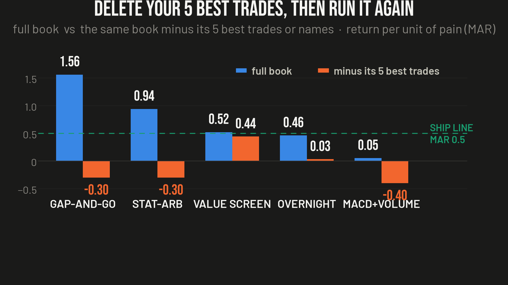

# Ep12 — How Much Backtesting Is Enough?

**Verdict: it isn't a number of years. Eleven strategies on this channel had ten years of data and hundreds of trades, and almost every one was still wrong. "Enough" is when the result survives six honest attempts to kill it — and most don't.**

This episode has no new backtest of its own. It is the methodology the other eleven produced, written down. Every one of the six tests below is here because it fooled me first, so each links to the receipts for the episode where it happened.

Printable version of the list: [`the_six_checklist.png`](the_six_checklist.png).

## The bar

    MAR ≥ 0.5  AND  Sortino ≥ 1.0
      · net of DOUBLE the measured trading costs
      · on data the rule never saw
      · and still standing after deleting the five best trades

Miss any one and it doesn't ship. Notice there is no "years" in there.

- **MAR** = yearly return ÷ the deepest drawdown you had to sit through.
- **Sortino** = return measured against the bad days only.
- Win rate is a *descriptor*, not a target. A 30%-win trend system with 4R winners beats a 60%-win system with 0.5R winners.

## The six tests

### 1. Who is actually in the data?
Could you have bought these names on day one of the test?

- A 14-stock overnight basket passed every test I had — until I checked. **Palantir wasn't public in 2016**; the backtest bought it anyway. → [ep01-overnight-effect](../ep01-overnight-effect)
- A value screener's **#2 pick was Coinbase**, which joined the index it was screening in 2025.

Survivorship bias is the most common way a backtest lies, because it doesn't feel like cheating. It feels like research.

### 2. Charge for every trade, then double it
- The overnight anomaly was **real** and died the moment it paid a nickel: ~2 trades/day × 5 bps round trip × 10 years multiplies your money by **~0.26**. Three-quarters goes to the tollbooth. A real fund tried to run that trade and liquidated in Aug 2023. → [ep01-overnight-effect](../ep01-overnight-effect)
- Costs lie in **both** directions. On the stat-arb book, estimated spreads (Corwin–Schultz, mean 21.5 bps; one name 108 bps estimated vs ~27 real) were over-charging it. Measured spreads (~6 bps) flipped a hard fail into a pass. → [ep06-statarb-postmortem](../ep06-statarb-postmortem)

Measure the real ones, run at double, and if it only works at single cost, it doesn't work.

### 3. Delete your five best trades and run it again
The one I'd keep if I could keep only one.

| strategy | MAR, full book | MAR, minus top 5 |
|---|---|---|
| gap-and-go | 1.56 | −0.30 |
| stat-arb | 0.94 | −0.30 |
| value screen | 0.52 | 0.44 |
| overnight | 0.46 | 0.03 |
| MACD + volume | 0.05 | −0.40 |

- The gap-and-go bot: **537 trades, and 3 of them were 92% of the profit.** → [ep02-gap-and-go](../ep02-gap-and-go)
- MACD + volume: 49 stocks, **5 were half the money.** → [ep10-macd-volume](../ep10-macd-volume)
- Stat-arb: Sortino **1.53 → −0.51** when five names out of 96 came out. → [ep06-statarb-postmortem](../ep06-statarb-postmortem)

Every one of those had years of data and hundreds of trades. If the edge is real, five trades out of five hundred shouldn't matter. If it dies, you didn't have an edge — you had a lottery ticket and a spreadsheet.

### 4. Data it never saw — and better than a coin flip on it
- 15 spreads looked perfect in-sample. On data they'd never seen, **zero survived.** → [ep06-statarb-postmortem](../ep06-statarb-postmortem)
- The half nobody mentions: the moment you look at the held-back result and tweak one thing, you've tuned on it too. It isn't held back anymore.
- And "it worked" isn't the bar — *better than random* is. My clever winner-picker landed at the **55th percentile of random**. The middle.

### 5. Go looking for zeros
- **0 trades is almost never caution.** It's a broken gate firing on missing data — I once had a news filter reject every day that had *no news*. It looked like discipline. It was a bug.
- **Phantom flat days pad the number.** A backtest quietly filled the years before some markets existed with zeros; a flat zero every day for four years makes everything look calmer than it was. Cutting ~1,300 of them brought the headline down ~8%. It still passed — but the number I'd been quoting was wrong, in the flattering direction, which is the only direction these things ever go.

### 6. "Enough years" = the years you're scared of
Not a fixed number — the number that contains the thing that kills your strategy.

- A dip-buyer needs a **crash** in the data: 5 years was plenty because those 5 included 2022. → [ep09-qqqm-dip-trail](../ep09-qqqm-dip-trail)
- A trend follower needs a long **sideways chop**, because that's what kills trend followers.
- A question about 1929 needs **100 years**; you cannot answer it with data from 2015. → [ep11-dca-vs-lumpsum](../ep11-dca-vs-lumpsum)
- And ten years with five trades in it is not ten years of evidence. It's five coin flips.

## The other side, honestly

Every one of these tests is free, and **eleven strategies died on a laptop instead of in an account.** Backtesting didn't fail on those — it saved me every time I was willing to try to kill the result instead of admire it.

A backtest can also be wrong in the **pessimistic** direction. My gap-and-go bot was audited three times and all three said "no edge, dead." The backtest was screening on the wrong thing and missing ~42% of the setups the live strategy was actually taking. Fixed and re-run, the signal was there. It still wasn't tradeable — three trades were the whole profit — but it wasn't dead either, and I nearly buried something real because I trusted a number I hadn't tried to break. → [ep02-gap-and-go](../ep02-gap-and-go)

The tool is the best thing a regular person has. It just has to be pointed at yourself.

## Every episode this draws on

| ep | subject | receipts |
|---|---|---|
| 1 | the overnight effect | [ep01-overnight-effect](../ep01-overnight-effect) |
| 2 | gap-and-go | [ep02-gap-and-go](../ep02-gap-and-go) |
| 3 | Kelly sizing | [ep03-kelly-sizing](../ep03-kelly-sizing) |
| 4 | the RenTec 51% | [ep04-rentec-51pct](../ep04-rentec-51pct) |
| 5 | GEX / dealer hedging | [ep05-gex-dealer-hedging](../ep05-gex-dealer-hedging) |
| 6 | stat-arb postmortem | [ep06-statarb-postmortem](../ep06-statarb-postmortem) |
| 7 | Kronos foundation model | [ep07-kronos-foundation-model](../ep07-kronos-foundation-model) |
| 8 | the VIX cheat sheet | [ep08-vix-cheatsheet](../ep08-vix-cheatsheet) |
| 9 | QQQM dip + trail | [ep09-qqqm-dip-trail](../ep09-qqqm-dip-trail) |
| 10 | MACD + volume | [ep10-macd-volume](../ep10-macd-volume) |
| 11 | DCA vs lump sum | [ep11-dca-vs-lumpsum](../ep11-dca-vs-lumpsum) |

## Notes

- Findings only. Where a currently-running strategy is referenced, it stays unnamed and no signal, holdings, parameters or timing are published.
- Not investment advice, and I'm not licensed to give it. One guy who has been fooled by his own spreadsheets enough times to make a list. Find an error and I'll pin the correction.
